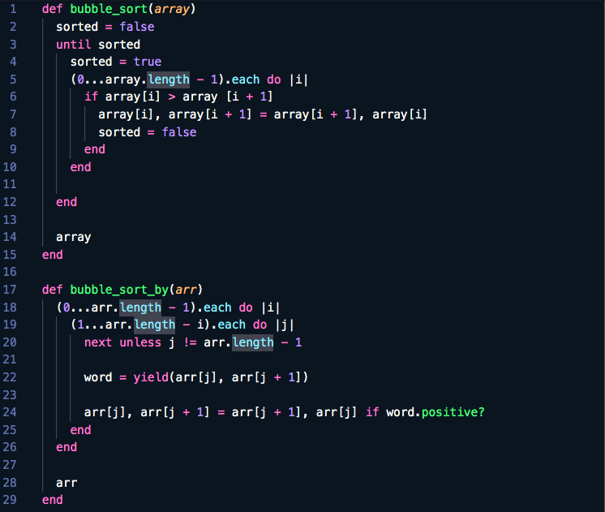

# Bubble-sort

In this project, we were asked to build a bubble sorting algorithm where each element is compared to the one next to it and they are swapped if the one on the left is larger than the one on the right. This continues until the array is eventually sorted.
 

## Built With

- RUBY

## Authors

👤 **Brittany Blake**

- Github: [@BrittanyBlake](https://github.com/BrittanyBlake)
- Twitter: [@bbcodes_](https://twitter.com/bbcodes_)
- Linkedin: [Brittany Blake](https://www.linkedin.com/in/brittany-blake-843951109/)

👤 **Davis Dambis**

- Github: [@davisdambis](https://github.com/davisdambis)
- Twitter: [@DDambis](https://twitter.com/DDambis)
- Linkedin: [Davis Dambis](https://www.linkedin.com/in/dāvis-dambis-51551219a/)

## 🤝 Contributing

Contributions, issues and feature requests are welcome!

Feel free to check the [issues page](https://github.com/BrittanyBlake/Bubble-sort/issues).

## Show your support

Give a ⭐️ if you like this project!

## 📝 License

This project is [MIT](lic.url) licensed.

